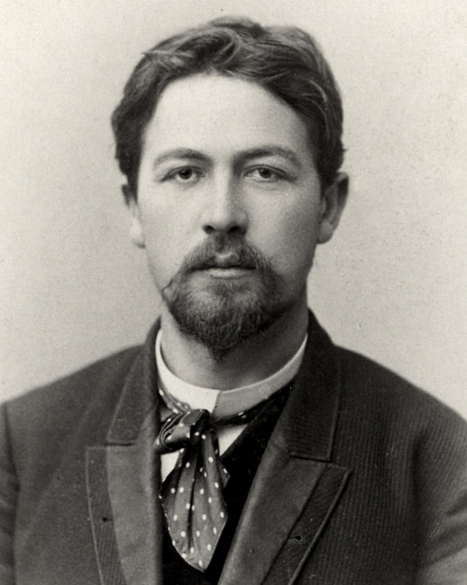

# How to use it



```javascript

```

> Most attributes and tags used by Chekhov.JS require adding a reactive computed property or a value into values object

```javascript
let ch = new Chekhov({
    reactive:
    {
        name_of_computed_property: function (i) {
            return it_s_value
        }
    }
}, values)
```

## There will be HTML in this section and the following one, prepare for it

* Use ch-for to display a list of something using an 'iterator' computed property defined in Chekhov class instance inside 'reactive' \(it can have any name, just set it in 'trigger' attribute

  ```markup
      <div ch-for linked="array" trigger="iterator">
          <h1 ch-bind>{{iterator}}</h1>
      </div>  
  ```

* Use ch-bind to bind {{key}} to such key inside ch.reactive or inside values object
* Use ch-if to check if linked attibute is true

```markup
        <div ch-if linked="reference">
                <h1>It's true</h1>
        </div>
```

* Use ch-model to dynamically change  'linked' value on 'trigger' event

```markup
<input ch-model linked="reference" trigger="input" />
```

```text

```



